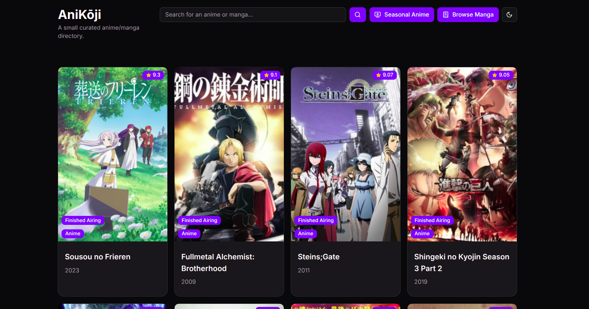

# 🎌 AniKōji

A small curated anime/manga directory. built with **Next.js 14**, **Tailwind CSS**, **ShadCN UI**, and powered by the [Jikan API](https://jikan.moe/). View anime or manga details, search your favorites, and toggle light/dark themes with a clean responsive UI.

---

## 🚀 Features

- 🔍 **Search** anime and manga by title
- 🖼️ View cards with images, title, episodes, type, year, and synopsis
- 🔄 Pagination with Framer Motion animations
- 🌓 Light/Dark/Auto theme toggle
- 🪪 Detail view in **Dialog** or full page
- 📱 Mobile-friendly and responsive
- 🎥 Seasonal anime and 📚 top manga toggles
- 🏷️ Badge overlays for Anime or Manga
- 🏢 Fetch and display **producers** and **studios**
- 📄 SEO-friendly using Next.js app router

---

## 📸 Preview

> 

---

## 🧱 Tech Stack

- **Framework**: [Next.js 14](https://nextjs.org)
- **UI Kit**: [ShadCN UI](https://ui.shadcn.com)
- **Styling**: [Tailwind CSS](https://tailwindcss.com/)
- **Animation**: Framer Motion
- **Data**: [Jikan API](https://jikan.moe)
- **Icons**: [Lucide React](https://lucide.dev/)
- **Image Optimization**: Next.js `<Image />`

---

